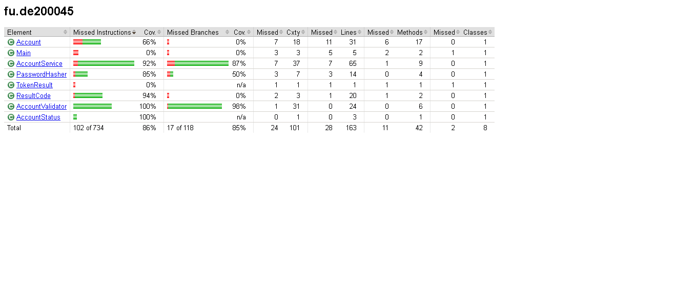

# Lab 2 — Account Service (Progress Test 1)

**Sinh viên:** <Nguyễn Lâm Thi> — <DE200045>
**Môn:** SWT301 — Software Testing
**Package:** `fu.de200045`

## 1. Cách chạy

```bash
mvn clean test
```

Báo cáo coverage sinh tại: `target/site/jacoco/index.html`

## 2. Kết quả test

- Tổng số test: **124**
- `mvn clean test`: **0 failures, 0 errors, 0 skipped**
- Số `@ParameterizedTest`: **<18>**
- Tổng số lượt chạy (bao gồm mỗi dòng CSV/MethodSource): **124**

## 3. Coverage (JaCoCo)

| Class | Line coverage | Branch coverage |
|---|---|---|
| `AccountService` | 92% | 87% |
| `AccountValidator` | 100% | 98% |

*(Ngưỡng yêu cầu: Line ≥ 80%, Branch ≥ 70% — cả 2 class đều đạt)*



## 4. Mutation testing thủ công

| # | Lỗi chèn | Test fail | Đã hoàn tác |
|---|---|---|---|
| M1 | `login()`: đổi `>=` thành `>` ở điều kiện khóa tài khoản | `Login.login_FifthFailedAttempt_LocksAccount` | ✅ |
| M2 | `login()`: xóa nhánh `if (acc.isLocked())` | `Login.login_LockedAccount_CorrectPassword_StillReturnsAccountLocked` | ✅ |
| M6 | `Account.unlock()`: quên đặt lại `failedAttempts = 0` | Ban đầu **không có test nào fail** → đã bổ sung `Login.login_AfterUnlock_FailedAttemptsResetToZero`, chèn lại lỗi lần 2 → test mới fail đúng kỳ vọng | ✅ |

## 5. Ma trận truy vết (Business Rule → Test)

### AccountValidator

| BR | Mô tả | Test |
|---|---|---|
| REG-02 | Username đúng định dạng | `Username.isValidUsername_ValidValues_ReturnsTrue`, `isValidUsername_InvalidValues_ReturnsFalse`, `isValidUsername_BoundaryLength` |
| REG-04 | Email đúng định dạng | `Email.isValidEmail_Partitions`, `isValidEmail_BoundaryLength` |
| REG-06 | Mật khẩu đủ mạnh, không chứa username | `Password.isValidPassword_Partitions`, `isValidPassword_BoundaryLength` |
| REG-08 | Tính tuổi đúng (kể cả năm nhuận) | `calculateAge_Boundaries` |
| REG-09 | Số điện thoại đúng định dạng | `Phone.isValidPhone_ValidPrefixes_ReturnsTrue`, `isValidPhone_InvalidValues_ReturnsFalse` |

### AccountService.register()

| BR | Mô tả | Test |
|---|---|---|
| REG-01 | Input rỗng/null/ngày sinh tương lai | `register_UsernameNullEmptyBlank_ReturnsInvalidInput`, `register_EmailNullEmptyBlank_ReturnsInvalidInput`, `register_PasswordNullEmptyBlank_ReturnsInvalidInput`, `register_AgeBoundary` (case tương lai) |
| REG-02 | Username sai định dạng | `register_InvalidInput_ReturnsExpectedCode` (case "username sai định dạng") |
| REG-03 | Trùng username (không phân biệt hoa/thường) | `register_DuplicateUsernameIgnoreCase_ReturnsDuplicateUsername` |
| REG-04 | Email sai định dạng | `register_InvalidInput_ReturnsExpectedCode` (case "email sai định dạng") |
| REG-05 | Trùng email (không phân biệt hoa/thường) | `register_DuplicateEmailIgnoreCase_ReturnsDuplicateEmail` |
| REG-06 | Mật khẩu yếu | `register_InvalidInput_ReturnsExpectedCode` (case "password yếu") |
| REG-07 | Confirm không khớp | `register_InvalidInput_ReturnsExpectedCode` (case "confirm không khớp") |
| REG-08 | Chưa đủ tuổi | `register_AgeBoundary` (18/17 tuổi) |
| REG-09 | Phone sai định dạng | `register_InvalidInput_ReturnsExpectedCode` (case "phone sai định dạng") |
| REG-10 | Đăng ký thành công | `register_ValidData_CreatesActiveAccountWithHashedPassword` |
| Thứ tự ưu tiên | Vi phạm nhiều rule cùng lúc | 3 case cuối trong `invalidRegisterInputs()` |

### AccountService.login()

| BR (Decision table #) | Mô tả | Test |
|---|---|---|
| 1 | User không tồn tại | `login_UserNotExist_ReturnsInvalidCredentials` |
| 2 | Tài khoản DISABLED | `login_DisabledAccount_ReturnsAccountDisabled` |
| 3 | Đang khóa, mật khẩu đúng vẫn chặn | `login_LockedAccount_CorrectPassword_StillReturnsAccountLocked`, `login_LockedAccount_AttemptsDoNotIncreaseFurtherWhenAlreadyLocked` |
| 4 | Sai mật khẩu, chưa đủ ngưỡng | `login_FourFailedAttempts_StillInvalidCredentials_NotLocked` |
| 5 | Sai mật khẩu, đủ 5 lần → khóa | `login_FifthFailedAttempt_LocksAccount` |
| 6 | Đăng nhập đúng, reset bộ đếm | `login_CorrectPassword_ReturnsSuccessAndResetsFailedAttempts` |
| LOG-01 | Input rỗng/null | `login_UsernameNullEmptyBlank_ReturnsInvalidInput`, `login_PasswordNullEmptyBlank_ReturnsInvalidInput` |
| Bảo mật | Không lộ user tồn tại hay không | `login_UserNotExist_And_WrongPassword_ReturnSameCode` |
| — | Sau mở khóa, bộ đếm về 0 | `login_AfterUnlock_FailedAttemptsResetToZero` |

## 6. Checklist tự đánh giá

### A. Mã production
- [x] A1 `mvn clean compile` thành công
- [x] A2 `AccountValidator` đủ 5 hàm, null trả `false`
- [x] A3 Mật khẩu băm SHA-256 + salt riêng
- [x] A4 `register()` đủ BR-REG-01..10, đúng thứ tự
- [x] A5 `login()` khóa sau 5 lần sai, đang khóa không tăng bộ đếm, thành công reset về 0
- [x] A6 `unlockAccount()` mở khóa và đặt `failedAttempts = 0`
- [x] A7 Username/email không phân biệt hoa/thường
- [x] A8 Không dùng `Clock`/`System.out`/biến static giữ trạng thái

### B. Mã test
- [x] B1 ≥ 20 phương thức test, ≥ 12 `@ParameterizedTest`, ≥ 60 lượt chạy
- [x] B2 Đủ `@ValueSource`, `@NullAndEmptySource`, `@CsvSource`, `@MethodSource`
- [x] B3 Biên username 4/5/20/21, mật khẩu 7/8/32/33, email 100/101, tuổi 17/18
- [x] B4 Biên đăng nhập sai 4/5 và test mở khóa
- [x] B5 ≥ 3 test thứ tự ưu tiên trong `register()`
- [x] B6 `@Nested` + `@BeforeEach` tạo service mới mỗi test
- [x] B7 Assert cả trạng thái, không `assertTrue(true)`, không `Thread.sleep`
- [x] B8 Tên test theo mẫu `method_TinhHuong_KetQua`

### C. Chất lượng và nộp bài
- [x] C1 `mvn clean test`: 0 failures/errors/skipped
- [x] C2 JaCoCo Line ≥ 80%, Branch ≥ 70% (có ảnh chụp)
- [x] C3 ≥ 3 lỗi giả lập có ghi lại
- [x] C4 Lịch sử git ≥ 6 commit đúng Conventional Commits
- [x] C5 File zip đúng tên, không có `target/`